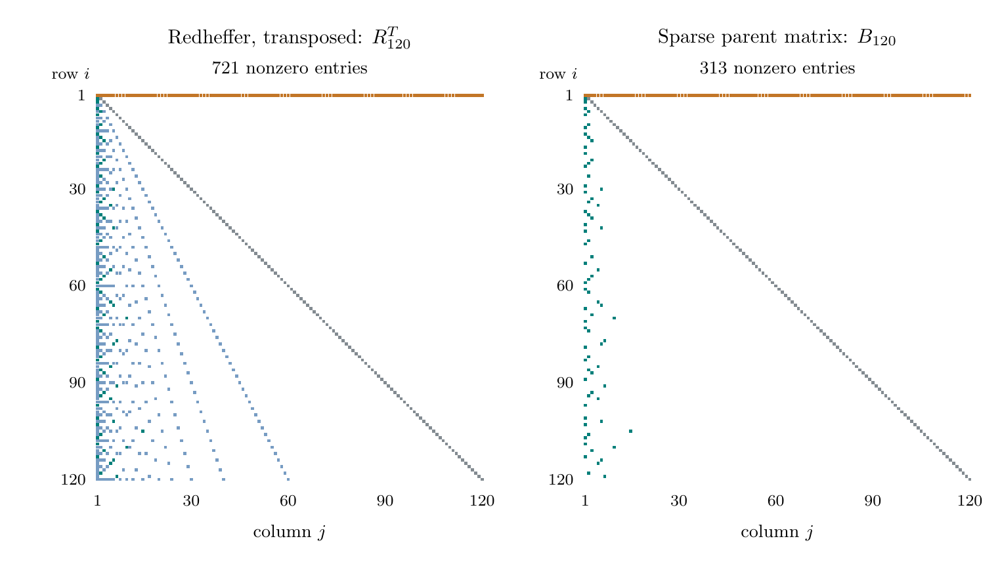

# The singular spectrum of a sparse Mertens matrix

Jeffery Kline

**Version 0.1.0 — release candidate, not yet archived.** No DOI exists for
this version yet. It is prepared for release under the project's
[public research standard](https://jeff-kline.github.io/posts/research-program/index.html).
Admission under that standard is a release decision, not peer review or a
correctness certificate.

The paper is [paper/main.pdf](paper/main.pdf); its source is
[paper/main.tex](paper/main.tex).

## Introduction

This paper studies the n × n matrix `B_n` formed by placing ones on the
diagonal and at `(i, i/P⁺(i))` for each squarefree `i > 1` (no prime square divides `i`), then replacing the
first row by ones; all other entries are zero. Here `P⁺(i)` is the largest
prime factor of `i`, and `i/P⁺(i)` is called the parent of `i`; these parent
links form a tree on the squarefree integers. The matrix was introduced by
Kline (2019) and satisfies

```text
det B_n = M(n) = μ(1) + μ(2) + ... + μ(n),
```

where μ is the Möbius function. Redheffer's matrix has the same determinant
but many more nonzero entries:



*Nonzero entries at n = 120. Orange marks the first row, gray the remaining
diagonal, green the parent links kept in `B_n`, and blue the other divisor
entries present only in Redheffer's matrix.*

The paper finds how many singular values of `B_n` equal one, compares the large
ones with square roots of parent degrees, and gives limits for the small ones
through an explicit compact operator, including when the matrix is singular.
The smallest singular value is the exception: it depends on `M(n)` and on the
norm of a vector of restricted Möbius sums. Classical estimates give the size
of that norm, moments and support-constrained sums of the restricted sums, and
products of singular values. No stronger estimate for `M(n)` or for prime
counting follows.

## Main results

The singular values of `B_n` are the square roots of the eigenvalues of
`B_nᵀB_n`, listed in decreasing order, σ₁ ≥ … ≥ σₙ. Let `k_n` be the
number of integers up to n that have at least one child in the tree.

1. **Almost all singular values equal one.** For n ≥ 4, exactly
   `n − 2k_n − 1` of them do, and `k_n = O(n/(log n)^H)` for every fixed H.
2. **The upper singular values follow the parent degrees.** Apart from
   σ₁ ~ √n, each is within 3 of the square root of a parent's number of
   children. For fixed r, σ_{r+1} is asymptotic to `√(n / (a_r log n))`,
   where `a_r` is the r-th squarefree integer.
3. **The lower singular values have an explicit limit.** For each fixed
   r ≥ 1, `√n · σ_{n−r}` converges to `λ_r(L)^(−1/2)`, where `λ_r(L)` is the
   r-th largest positive eigenvalue of an explicit compact operator L built
   from the tree. The limit runs through all positive integers n, including
   those where `M(n) = 0` and the matrix is singular.
4. **The smallest singular value carries the Mertens sum.** Whenever
   `M(n) ≠ 0`,

   ```text
   σ_n(B_n) ~ |M(n)| / (√Q(n) · W_n),
   W_n = n · exp(−(1 + o(1)) √(log n · log log n)),
   ```

   where `Q(n)` counts the squarefree integers up to n and `W_n` is the norm of
   an explicit vector of restricted Möbius sums. Equivalently,
   `σ_n(B_n) = |M(n)| · n^(−3/2) · exp((1 + o(1)) √(log n · log log n))`.
   This holds unconditionally.

The paper also proves estimates for products of singular values, moments and
support-constrained sums of the restricted Möbius sums, and a Dickman–Buchstab
profile for a geometric residual.

**No stronger estimate for the Mertens function, prime counting, or the
Riemann hypothesis follows.** The formula in item 4 contains `M(n)`, so it
restates the Mertens sum rather than bounding it. Section 7.1 of the paper
explains what additional input a stronger Mertens bound would require.

## What is new, and what is not

The closest earlier work is the author's own release
[*The smallest singular value of a sparse Mertens matrix*](https://doi.org/10.5281/zenodo.21774716)
(version 0.1.0, 2026), on the same matrix. It proved

```text
|M(n)| n^(−3/2+o(1))  ≤  σ_n(B_n)  ≤  |M(n)| n^(−4/3+o(1)),
```

obtained the lower scale as an equivalent only under a rank-one dominance
condition implied by the Riemann hypothesis, and posed the shape of `W_n` in
item 4 as an open problem. This paper proves that shape. The dominance
condition then always holds, and the bracket becomes an asymptotic equivalent
without any hypothesis. The paper also replaces the earlier estimate
`‖A_n⁻¹‖ = n^(1/2+o(1))`, for the triangular matrix `A_n` (that is, `B_n`
before its first row is replaced), by an exact limiting constant. The earlier release has the sharper estimate for the largest singular
value. Items 1–3, the products, and the geometric results do not appear there.

Other credit:

- **Redheffer (1977)** introduced the classical matrix with determinant
  `M(n)`: R. Redheffer, *Eine explizit lösbare Optimierungsaufgabe*, in
  Numerische Methoden bei Optimierungsaufgaben, Band 3, Birkhäuser, 1977,
  213–216.
- **Hilberdink (2017)** developed compact Gram limits for arithmetic
  (multiplicative Toeplitz) matrices. The general method and the idea of a
  fixed lower-spectrum limit are his. The contribution here is the explicit
  kernel for this parent tree, the deflation for the bordered matrix, and the
  exact unit and degree results.
- **Alladi (1982)** studied the restricted Möbius sums and the bounded
  least-prime weighted extremum. His asymptotic for the sums holds as a
  relative estimate only while `u = log x / log y` stays below about
  `(log x)^(1/3)`. The estimate for `W_n` needs `u` near
  `(log n / log log n)^(1/2)`, where the paper proves the relative asymptotic
  from the classical Mertens bound and a two-term smooth-number expansion of
  de Bruijn and Saias, in the form stated by McNew (2017). Alladi's companion
  paper (Trans. AMS, 1982) and a related 1990 paper of Tenenbaum could not be
  read, so priority for this step is not established.
- **Kline (2019, 2020)** introduced the matrix, found its dominant
  eigenvalues, and proved the bordered-matrix identity behind the geometric
  base volume.
- **Kural, McDonald, and Sah (2020)** already give the zero value of the
  unweighted thin-prime reciprocal series; the paper adds a quantitative tail.

These comparisons come from a bounded literature search recorded in
[audit/](audit/). They do not establish worldwide novelty. Priority for the
arithmetic moment and support-constrained formulations is not established.

## Evidence and limits

- Every result is proved in the paper from explicitly stated classical inputs:
  the prime number theorem, a classical Mertens bound, smooth- and rough-number
  asymptotics, and, in an optional appendix only, Halász's theorem. No
  numerical computation is used as evidence for any theorem.
- The proofs were checked by process-separated AI audits. No independent human
  expert has reviewed them. Agreement among AI checks is evidence about a
  process, not independent validation.
- Limiting constants, such as the limit of `‖A_n⁻¹‖/√n` and the `λ_r(L)`,
  are defined exactly but not evaluated numerically; certified values would need rigorous truncation
  bounds.

## Reproduce

Requirements: pdfLaTeX (tested with TeX Live 2021) and Poppler's `pdfinfo` and
`pdftotext`. The checker uses only the Python standard library and must run
from an isolated environment:

```sh
python3 -m venv .venv            # any Python 3.10+ interpreter
make paper                        # four pdfLaTeX passes; fixed SOURCE_DATE_EPOCH
make check                        # labels, citations, TeX log, and PDF text
shasum -a 256 -c MANIFEST.sha256
```

`make check` checks the document's consistency; it does not check proofs. The
Redheffer comparison figure is exact vector source; regenerate it with
`.venv/bin/python paper/figures/build_comparison.py`, and its README image
with `make readme-figure`.

## Repository contents

- `paper/`: LaTeX source (`main.tex`, `sections/`, `figures/`) and the reading
  copy `main.pdf`.
- `scripts/check_paper.py`: document consistency checker.
- `audit/`: prior-art comparisons, proof reviews, and their dispositions;
  `audit/drafting/` keeps the records from the drafting stage.
- `ADMISSION.md`, `VERIFICATION.md`, `CORRECTIONS.md`, `CITATION.cff`,
  `MANIFEST.sha256`: release records. `audit/LEDGER.md` lists every audit
  finding and its disposition.

## Role of AI

AI did the derivations, literature search, exposition, and audits under the
author's direction. The author chose the questions and is responsible for the
result and its corrections.

## License

GPL-3.0-only. See [LICENSE](LICENSE).
